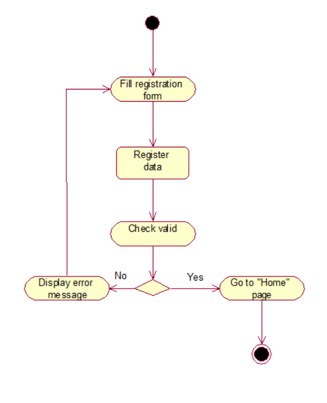
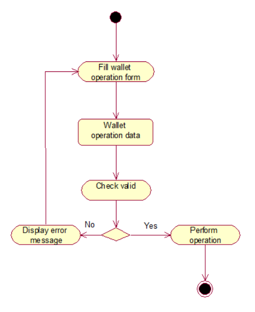
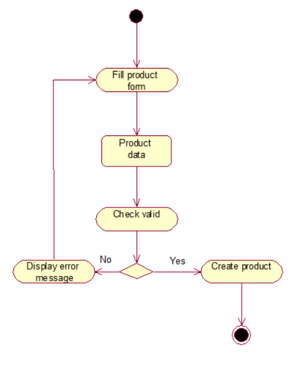

# UML Диаграммы
1. [Диаграмма прецедентов](#1) 
1.1 [Актёры](#1.1) 
1.2 [Варианты использования](#1.2) 
1.2.1 [Вход в систему](#1.2.1) 
1.2.2 [Регистрация](#1.2.2) 
1.2.3 [Просмотр продуктов](#1.2.3) 
1.2.4 [Просмотр детальной информации о продукте](#1.2.4) 
1.2.5 [Создание кошелька](#1.2.5) 
1.2.6 [Операции над кошельком](#1.2.6) 
1.2.7 [Оформление подписки](#1.2.7) 
1.2.8 [Создание продукта](#1.2.8) 
1.2.9 [CRUD большинства данных в DB](#1.2.9) 
2. [Диаграммы активности](#2) 
2.1 [Вход в систему](#2.1) 
2.2 [Регистрация](#2.2) 
2.3 [Просмотр всех продуктов](#2.3) 
2.4 [Просмотр детальной информации о продукте](#2.4) 
2.5 [Создание кошелька](#2.5) 
2.6 [Операции над кошельком](#2.6) 
2.7 [Оформление подписки](#2.7) 
2.8 [Создание продукта](#2.8) 
2.9 [CRUD большинства данных в DB](#2.9) 
3. [Диаграмма последовательности](#3)

<a name="1"/>

### 1. Диаграмма прецедентов 
Диаграмма прецедентов представляет собой следующую диаграмму:

<a name="1.1"/>

#### 1.1 Актёры
Актёр | Описание
--- | ---
Посетитель|Человек, использующий приложение для просмотра продуктов, оформление подписки недоступно до входа в систему.
Пользователь|Человек, зарегистрированный в системе, использующий приложение для оформления подпискок на определенные товары.
Контент менеджер|Человек, зарегистрированный в системе, использующий приложение для создания новых продуктов. Также он может оформлять подписки на определенные товары.
Админ|Человек, зарегистрированный в системе, имеющий доступ к базе данных. Может делать все.

<a name="1.2"/>

#### 1.2 Варианты использования
Примечание: при указании повторения дествия, происходит повторение действия варианта использования, в котором оно возникло.

<a name="1.2.1"/>

##### 1.2.1 Вход в систему
**Описание.** Вариант использования "Вход в систему" позволяет посетителю авторизироваться в приложении.
Поток событий:
1. Посетитель нажимает клавишу "Sign in" на панели инструментов.
2. Приложение переходит на страницу входа в систему.
3. Посетитель вводит "Username" и "Password".
4. Посетитель нажимает клавишу "Sign in".
5. Приложение проверяет соответствие введенных данных с базой данных. При неверных данных приложение выводит сообщение об ошбике, посетитель повторяет действия 3 и 4.  
6. Приложение авторизирует посетителя, при этом заменяя клавишу "Sign in" на "Sign out".
7. Приложение направляет пользователя на страницу всех продуктов.
8. Конец.

<a name="1.2.2"/>

##### 1.2.2 Регистрация
**Описание.** Вариант использования "Регистрация" позволяет посетителю создать свою учетную запись в системе.
Поток событий:
1. Посетитель нажимает клавишу "Sign in" на панели инструментов.
2. Приложение переходит на страницу входа в систему.
3. Посетитель нажимает клавишу "Register".
4. Посетитель вводит "Username", "Name", "Password" и "Date of birth".
5. Посетитель нажимает клавишу "Register".
6. Приложение проверяет валидность и уникальность данных. При неверных данных приложение показывает сообщение об ошибке, далее посетитель повторяет дейстия 4 и 5.
7. Приложение добавляет нового пользователя в систему.
8. Приложение направляет пользователя на страницу всех продуктов.
9. Конец.

<a name="1.2.3"/>

##### 1.2.3 Просмотр продуктов
**Описание.** Вариант использования "Просмотр продуктов" позволяет пользователю просмотривать все продукты.
Поток событий:
1. Пользователь нажимает клавишу "Home" на панели инструментов.
2. Приложение переходит на станицу просмотра всех продуктов.
3. Конец.

<a name="1.2.4"/>

##### 1.2.4 Просмотр детальной информации о продукте
**Описание.** Вариант использования "Просмотр детальной информации о продукте" позволяет пользователю просматривать подробную информация о продукте, а также подписываться на продукт.
1. На странице просмотра продуктов пользователь нажимает на определенный продукт. Если пользователь не авторизирован, происходит переход к варианту использования [Вход в систему](#1.2.1), действие 2.
Поток событий:
2. Приложение переходит на страницу детального просмотра выбранного продукта.
3. Пользователь просматривает информацию о продукте.
4. Пользователь нажимает клавишу "Subscribe". При данном действии происходит переход к варианту использования [Оформление подписки](#1.2.7), действие 2.
5. Конец.

<a name="1.2.5"/>

##### 1.2.5 Создание кошелька
**Описание.** Вариант использования "Создание кошелька" позволяет пользователю создать кошелек.
Поток событий:
1. Пользователь нажимает клавишу "Wallets" на панели инструментов.
2. Приложение переходит на страницу кошельков.
3. Пользователь нажимает клавишу "+".
4. Пользователь вводит "Name" и "Description".
5. Пользователь нажимает клавишу "Create".
6. Приложение проверяет валидность данных. При неверных данных происходит повторение действия 4 и 5. 
7. Приложение создает кошелек с введенными данными.
8. Конец.

<a name="1.2.6"/>

##### 1.2.6 Операции над кошельком
**Описание.** Вариант использования "Операции над кошельком" позволяет пользователю выполнять такие действия как пополнение счета, перевод с одного кошелька на другой, редактирование и удаление.
Поток событий:
1. Пользователь нажимает клавишу "Wallets" на панели инструментов.
2. Приложение переходит на страницу кошельков.
3. Пользователь нажимает клавишу пополнения счета. При данном действии выполняется альтернативный поток A1.
4. Пользователь нажимает клавишу перевода. При данном действии выполняется альтернативный поток A2.
5. Пользователь нажимает клавишу редактирования. При данном действии выполняется альтернативный поток A3.
6. Пользователь нажимает клавишу удаления. При данном действии выполняется альтернативный поток A4.
7. Конец. Альтернативный поток А1:
8. Появляется всплывающее окно.
9. Пользователь вводит сумму, на которую хочет пополнить.
10. Пользователь нажимает клавишу "Top up".
11. Приложение проверяет валидность данных. При неверных данных происходит повторение действия 9 и 10.
12. Приложение пополняет кошелек на введенную сумму.
13. Конец. Альтернативный поток А2:
14. Появляется всплывающее окно.
15. Пользователь вводит сумму перевода и кошелек, на который хочет перевести.
16. Пользователь нажимает клавишу "Transfer".
17. Приложение проверяет валидность данных. При неверных данных происходит повторение действия 15 и 16.
18. Приложение переводит введенную сумму с данного кошелька на указанный.
19. Конец. Альтернативный поток А3:
20. Появляется всплывающее окно.
21. Пользователь редактирует "Name" и "Description".
22. Пользователь нажимает клавишу "Edit".
23. Приложение проверяет валидность данных. При неверных данных происходит повторение действия 21 и 22.
24. Приложение редактирует данные кошелька.
25. Конец. Альтернативный поток А4:
26. Приложение удаляет кошелек.
27. Конец.

<a name="1.2.7"/>

##### 1.2.7 Оформление подписки
**Описание.** Вариант использования "Оформление подписки" позволяет пользователю оформить подписку.
1. На странице просмотра детальной информации о продукте пользователь нажимает на кнопку "Subscribe".
Поток событий:
2. Пользователь указывает даты начала и окончания подписки и указывает кошелек.
3. Пользователь нажимает клавишу "Subscribe".
4. Приложение проверяет валидность данных. При неверных данных происходит повторение действия 2 и 3. 
5. Приложение создает подписку с введенными данными.
6. Конец.

<a name="1.2.8"/>

##### 1.2.8 Создание продукта
**Описание.** Вариант использования "Создание продукта" позволяет пользователю создать продукт.
Поток событий:
1. Пользователь нажимает клавишу "My Products" на панели инструментов.
2. Приложение переходит на страницу продуктов, созданных пользователем.
3. Пользователь нажимает клавишу "+".
4. Пользователь вводит данный продукта.
5. Пользователь нажимает клавишу "Create".
6. Приложение проверяет валидность данных. При неверных данных происходит повторение действия 4 и 5. 
7. Приложение создает продукт с введенными данными.
8. Конец.

<a name="1.2.9"/>

##### 1.2.9 CRUD большинства данных в DB

<a name="2"/>

### 2. Диаграммы активности

<a name="2.1"/> 

##### 2.1 Вход в систему
При заполнении форм данных происходит их валидация. При неверных данных выводится сообщение об ошибке с требованием повторить действие, иначе происходит авторизация и переход на страницу всех продуктов.

<a name="2.2"/>

##### 2.2 Регистрация
При заполнении форм данных происходит их валидация. При неверных данных выводится сообщение об ошибке с требованием повторить действие, иначе происходит регистрация нового пользователя и переход на страницу всех продуктов.

<a name="2.3"/>

##### 2.3 Просмотр всех продуктов
Пользователь просматривает продукты. При нажатии на продукт происходит переход на страницу детальной информации о продукте, при условии, что пользователь авторизован.

<a name="2.4"/>

##### 2.4 Просмотр детальной информации о продукте
Пользователь просматривает детальной информации о продукте.

<a name="2.5"/>

##### 2.5 Создание кошелька
При заполнении форм данных происходит их валидация. При неверных данных выводится сообщение об ошибке с требованием повторить действие, иначе происходит создание кошелька.

<a name="2.6"/>

##### 2.6 Операции над кошельком
При заполнении форм данных происходит их валидация. При неверных данных выводится сообщение об ошибке с требованием повторить действие, иначе происходит выбранная операция над кошельком.

<a name="2.7"/>

##### 2.7 Оформление подписки
При заполнении форм данных происходит их валидация. При неверных данных выводится сообщение об ошибке с требованием повторить действие, иначе создается подписка.

<a name="2.8"/>

##### 2.8 Создание продукта
При заполнении форм данных происходит их валидация. При неверных данных выводится сообщение об ошибке с требованием повторить действие, иначе создается продукт.

<a name="2.9"/>

##### 2.9 CRUD большинства данных в DB

<a name="3"/>
 
### 3. Диаграмма последовательности
Диаграмма последовательности основных вариантов использования представлена ниже:

