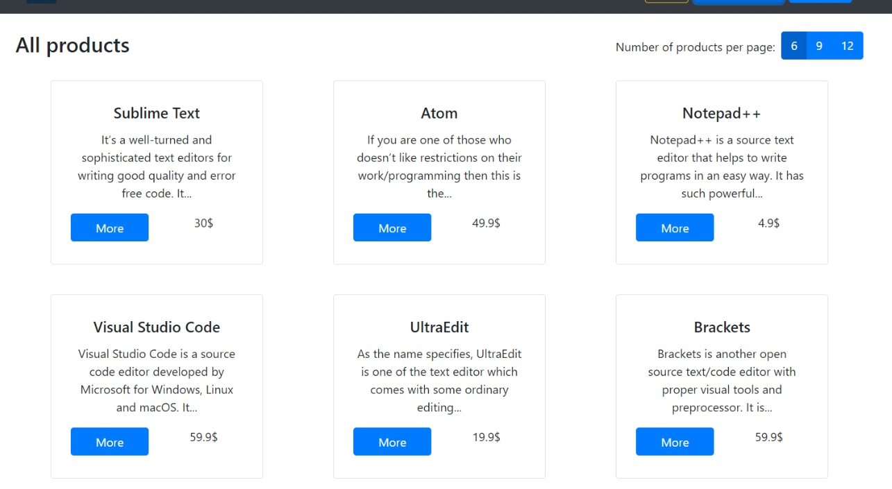
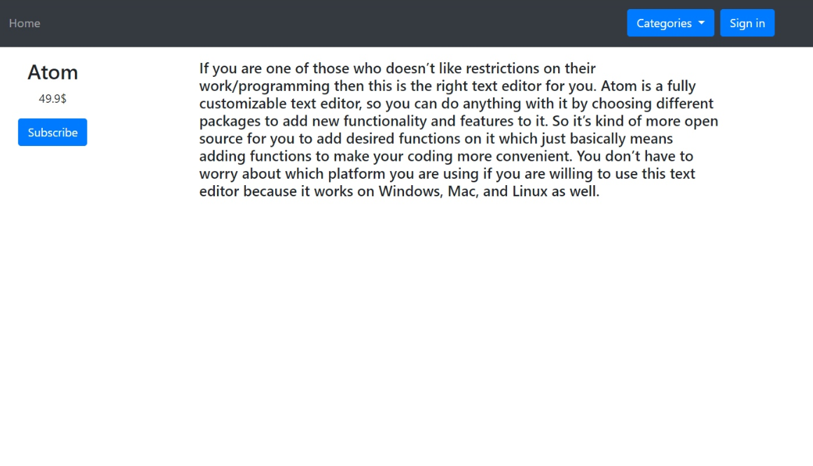
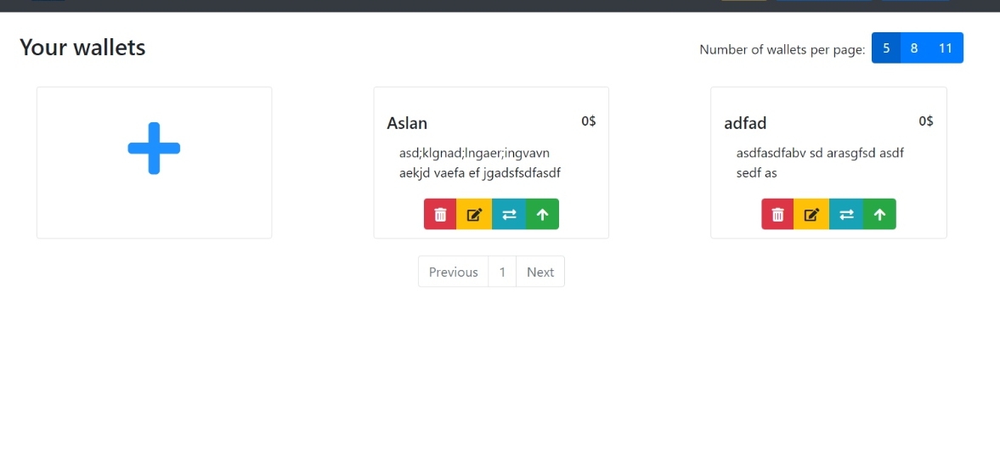
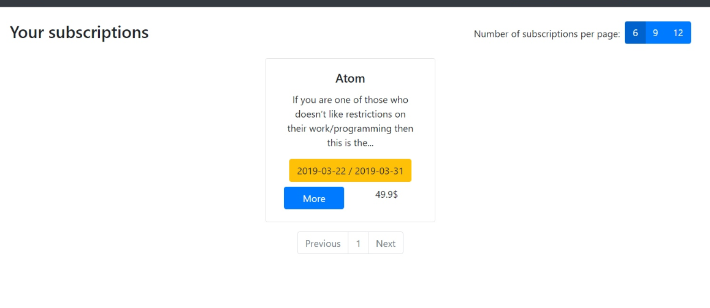
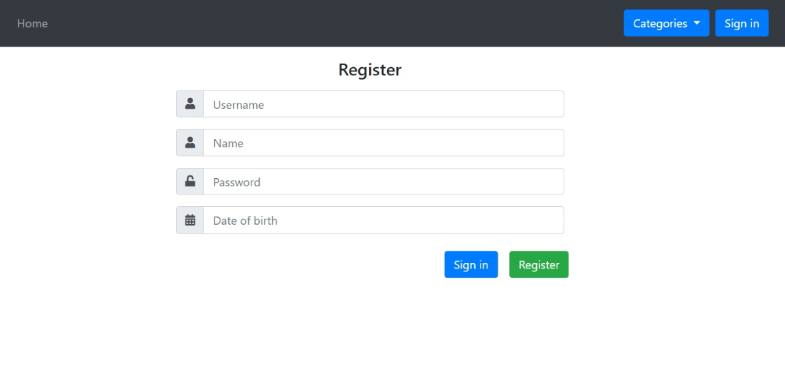
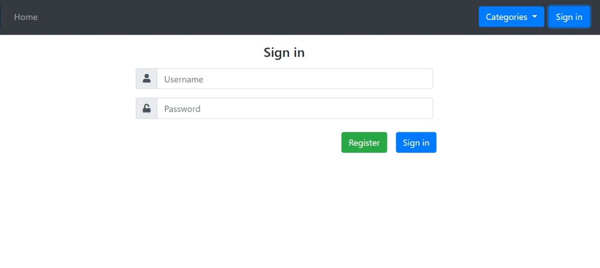

# Требования к проекту
---

## Содержание

1 [Введение](#intro)  
2 [Требования пользователя](#user_requirements)  
2.1 [Программные интерфейсы](#software_interfaces)  
2.2 [Интерфейс пользователя](#user_interface)  
2.3 [Характеристики пользователей](#user_specifications)  
2.3.1 [Классы пользователей](#user_classes)  
2.3.2 [Целевая аудитория приложения](#application_audience)  
2.4 [Предположения и зависимости](#assumptions_and_dependencies)  
3 [Системные требования](#system_requirements)  
3.1 [Функциональные требования](#functional_requirements)  
3.2 [Нефункциональные требования](#non-functional_requirements)  
3.2.1 [Атрибуты качества](#quality_attributes)  
3.2.1.1 [Требования к удобству использования](#requirements_for_ease_of_use)  
3.2.1.2 [Требования к безопасности](#security_requirements)  
4 [Аналоги](#analogues)   

<a name="intro"/>

# 1 Введение
AStore - web приложение, которое позволяет пользователям подписываться на продукты и создавать свои. Данное приложение имеет основные функции интернет-магазина подписок, а также реализует защиту пользовательских данных от злоумышленников.

<a name="user_requirements"/>

# 2 Требования пользователя

<a name="software_interfaces"/>

## 2.1 Программные интерфейсы
1. Пользовательский интерфейс будет реализован с помощью Angular Framework
2. Бекенд будет реализован на языке Java при помощи Spring Framework.
3. Для хранения данных будет использована свободная реляционная система управления базами данных MySQL.
4. Разработка будет проводиться в среде разработки Intellij Idea.

<a name="user_interface"/>

## 2.2 Интерфейс пользователя
Главная страница. На ней расположены все продукты
  
Окно просмотра детальной информации о продукте  
  
Окно кошельков  
  
Окно подписок  
  
Окно регистрации  
  
Окно входа в систему  
  

<a name="user_specifications"/>

## 2.3 Характеристики пользователей

<a name="user_classes"/>

### 2.3.1 Классы пользователей

* Admin - может делать всё.
* Content Manager - может создавать продукты, создавать кошельки и подписываться на продукы.
* User - может создавать кошельки и подписываться на продукты.

<a name="application_audience"/>

### 2.3.2 Целевая аудитория приложения

* Пользователи оформляющие подписки в интернет-магазине.
* Пользователи предоставляющие продукты с возможностью подписки на них.

<a name="assumptions_and_dependencies"/>

## 2.4 Предположения и зависимости
Приложение не работает при отсутствии подключения к Интернету.

<a name="system_requirements"/>

# 3 Системные требования

<a name="functional_requirements"/>

## 3.1 Функциональные требования

Пользователю предоставлены возможности:

| Функция | Требования | 
|:---|:---|
| Регистрация | При нажатии "Register" на отдельной web-странице при валидных введенных данных приложение должно добавлять нового пользователя в систему. Также при этом должен выполняется автоматический вход в систему этим пользователем. |
| Вход в систему | При нажатии "Sign in" на отдельной web-странице странице при валидных введенных данных должен выполниться вход в систему. |
| Просмотр продуктов | Приложение должно показывать фото продукта, краткое описание, цену. |
| Просмотр детальной информации о продукте | Приложение должно отображать всю информации о продукте. |
| Создание кошелька | При валидных введенных данных приложение должно создать новый кошелек для текущего пользователя. |
| Оформление подписки | При валидных введенных данных приложение должно добавить новую запись в базу данных, в которой будут храниться детали подписки. |
| Создание нового продукта | При валидных введенных данных приложение должно создать новый продукт. |

<a name="non-functional_requirements"/>

## 3.2 Нефункциональные требования

<a name="quality_attributes"/>

### 3.2.1 Атрибуты качества

<a name="requirements_for_ease_of_use"/>

#### 3.2.1.1 Требования к удобству использования
1. Понятный и простой интерфейс;
2. Для более удобного просмотра продуктов реализовать пагинацию.;
3. Возможность указания дат действия подписки.

<a name="security_requirements"/>

#### 3.2.1.2 Требования к безопасности
1. Admin имеет доступ к базе данных.
2. При регистрации пароль пользователя кодируется.

<a name="analogues"/>

### 4. Аналоги 
Аналогами данного проекта являются разные магазины, например [store.steampowered.com](https://store.steampowered.com/)
